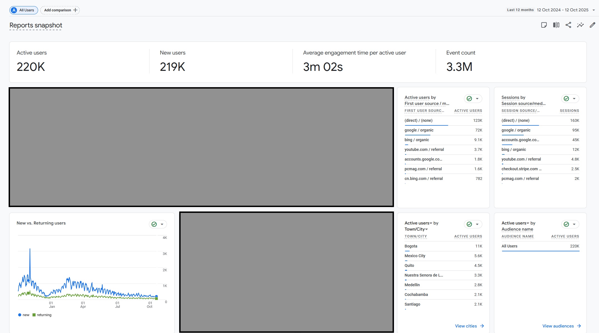
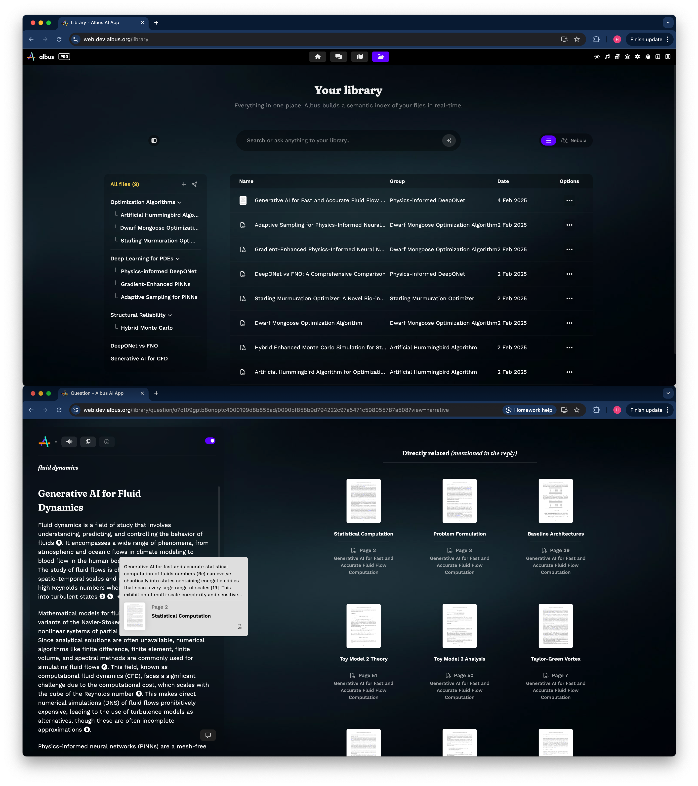
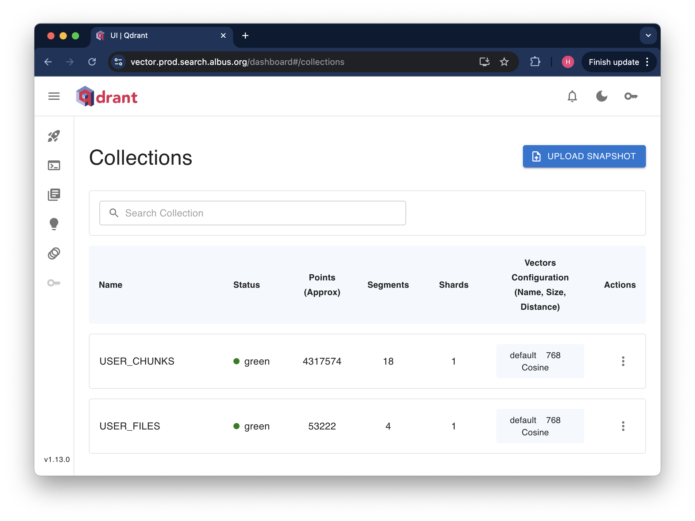

# Mandatory Criteria 1 - Technical Leadership at Albus Technologies

Over 6 months as Founding Engineer, I built Albus's core RAG system from the ground up, designing a hierarchical semantic chunking architecture that outperformed the industry standard (LangChain) by 30%. I solved a critical industry problem, LangChain's arbitrary text splitting, with an approach so effective that users willingly chose 30x slower processing for 2x better accuracy. After releasing my RAG architecture changes in Albus v2, over 220,000 users signed up to the platform in the past 12 months, with 50,000+ active users using my RAG system. The system I built processes 400,000+ documents into 4 million semantic chunks and handles 500,000+ monthly searches with 99.7% uptime and sub-200ms response times.

---

### System I Built

_220,000+ users signed up to Albus v2 in the past 12 months, where my RAG architecture changes were released_

_Top: Library view where users drag and drop thousands of documents of different modalities (PDF, image, code, text, audio, website) | Bottom: Search view where users ask questions and get detailed reports with relevant references from their libraries_

_System scale: 50,000+ users, 400,000+ documents processed, 4,000,000+ semantic chunks_

---

### Key Numbers

- **220,000+ users** signed up in past 12 months
- **400,000+ documents** processed into 4 million semantic chunks
- **100,000+ monthly searches** with 99.7% uptime and sub-200ms response times
- **30% improvement** over industry standard (LangChain)
