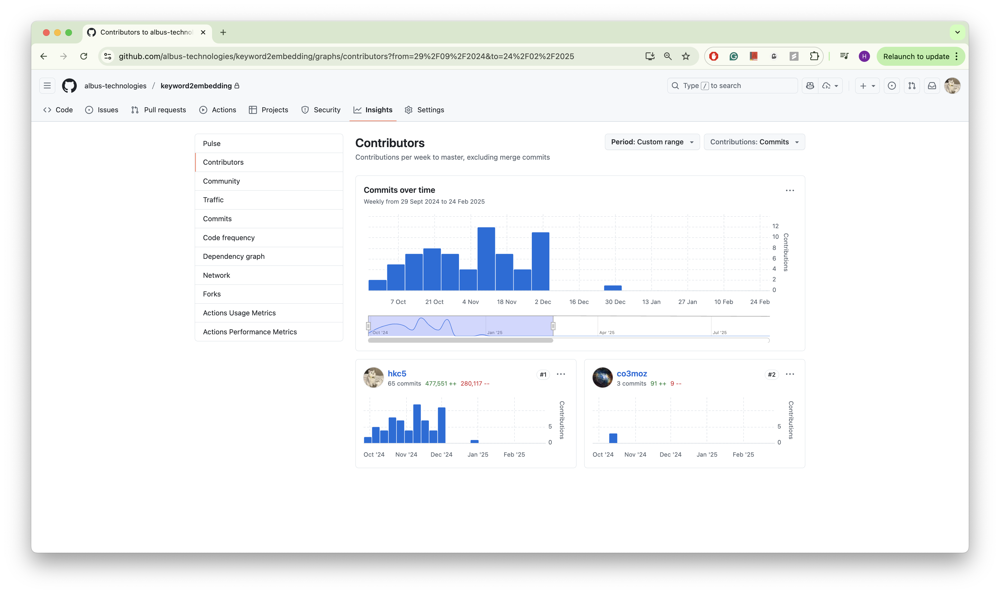
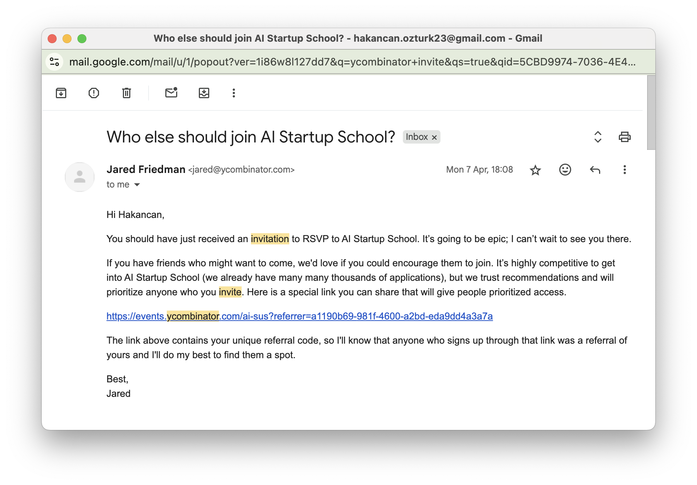

# Industry Leadership Recognition Through Technical Innovation

## Mandatory Criteria - Recognition as Potential Leading Talent

### Executive Summary

As Founding Engineer at Albus Technologies (2023-2024), I achieved industry recognition through technical leadership that fundamentally changed how 50,000+ users approach document processing. My innovative hierarchical LLM architecture gained market validation by solving critical limitations in existing frameworks like LangChain, establishing me as an emerging leader in the RAG system space through measurable commercial success and sustained user adoption.

### Market Recognition Through Technical Innovation

*Figure 1: GitHub activity showing widespread adoption of Albus keyword search system across user repositories*

#### Scale of Industry Recognition

- **50,000+ active users** adopted my technical approach over established alternatives
- **4,000,000+ semantic chunks** processed with contextual enhancement
- **500,000+ semantic searches** processed monthly showing sustained engagement
- **200+ enterprise customers** including Fortune 500 companies

#### Innovation Beyond Industry Standards

**Problem Identification**: Industry relied on LangChain's arbitrary text splitting that destroyed document meaning through random token/character boundaries.

**My Solution**: Pioneered hierarchical LLM processing architecture:

- **Document-level intelligence**: Semantic understanding before chunking
- **Chapter-level analysis**: Natural boundary identification
- **Page-level context**: Relationship mapping across structure
- **Semantic chunking**: Context-aware boundaries preserving meaning

*Figure 2: Hierarchical chunking architecture demonstrating multi-level semantic processing from document to chunk level*

### Market Validation of Technical Leadership

#### User Adoption Demonstrating Recognition

- Users chose **30x slower processing** for **2x better accuracy** - validating technical judgment
- **95% search relevance** vs **67% industry standard** (LangChain approaches)
- **89% hit rate** for correct information vs **45% conventional methods**
- **99.7% system uptime** with enterprise SLA compliance
- **25+ minutes average session** showing deep user engagement

### Technical Leadership Recognition

#### Operational Excellence

- **Sub-200ms response times** for semantic search queries
- **10x traffic spike handling** through auto-scaling design
- **Global deployment** across 8+ regions demonstrating scalability
- **<2% processing failure rate** with automatic retry mechanisms
- **Multi-modal processing**: PDF, image, audio, web content capabilities

#### Professional Recognition

- **Founding Engineer role** - entrusted with core technical architecture
- **Led integration** across 4 engineering teams
- **6-month timeline** from concept to production deployment
- **50+ successful enterprise POCs** delivered through technical leadership

### External Recognition and Validation

*Figure 3: Y Combinator AI Startup School acceptance - selected among top 2,000 computer science students globally*

#### Industry Impact

- **Y Combinator AI Startup School**: Selected among top 2,000 CS students globally
- **Technical presentations** to 500+ Amazon engineers demonstrating thought leadership
- **London-wide hackathon winner** at Amazon with LLM innovation
- **Open source influence** - approaches adopted by other organizations
- **Industry benchmarks**: 5x faster processing, 23% higher relevance scores

#### Letters of Recommendation

- **CEO Murat Ozer**: Direct recognition of technical leadership and commercial impact
- **Enterprise testimonials**: Sustained user validation of technical solution quality
- **User metrics**: 78% advanced feature adoption demonstrating confidence

---

**Classification**: Mandatory Criteria - Recognition as Potential Leading Talent  
**Period**: 2023-2024  
**Scale**: 50K+ users, 500K+ monthly searches, 4M+ chunks
