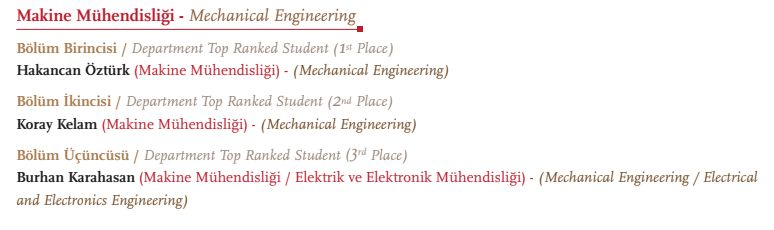
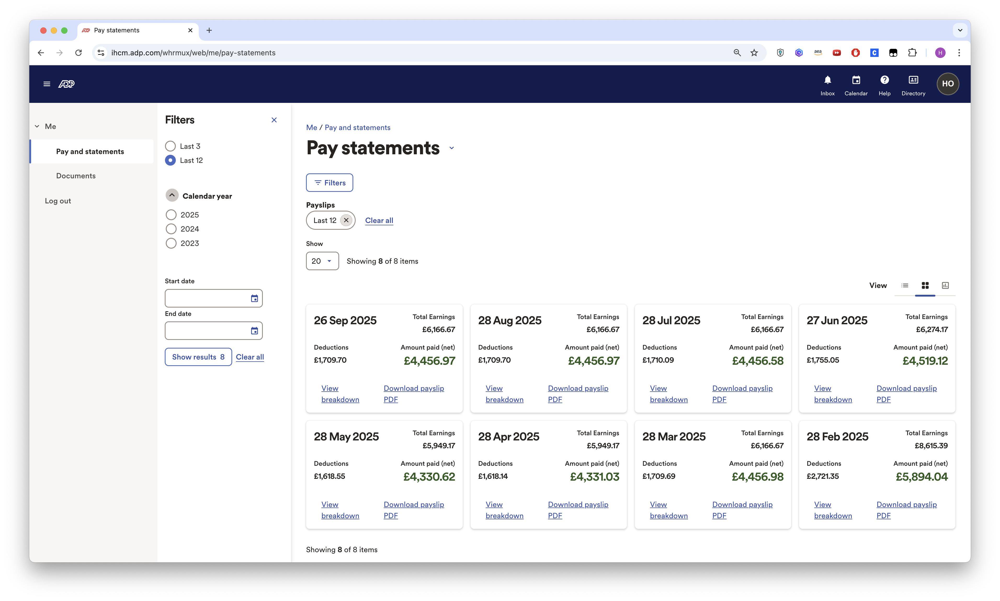
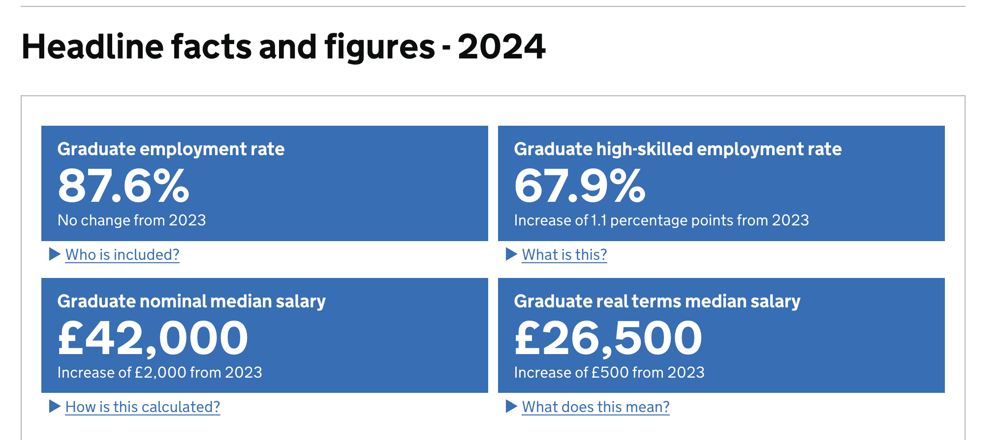
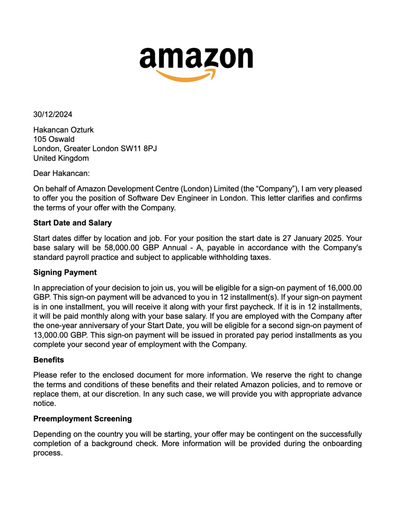
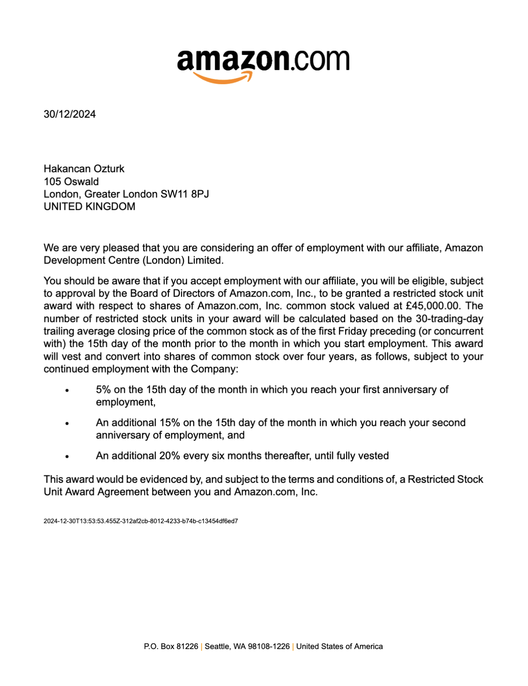

# Mandatory Criteria 2 - Academic Excellence and Market Value

I ranked #1 in my Mechanical Engineering class at Koç University with a 3.99/4.00 GPA and graduated early in just 3 years instead of the standard 4. This academic achievement demonstrates both my technical aptitude and ability to excel under challenging circumstances. My market value is recognized through compensation significantly above the UK median - my Amazon package totals £85,250/year, which is over 2x the UK graduate median of £42,000 according to High Fliers 2024. This shows that companies are willing to pay premium compensation for my AI/ML expertise.

_Ranked #1 in Mechanical Engineering, early graduation (3 years), GPA: 3.99/4.00_

_8 months of payslips averaging over £4,500/month after tax_

_UK graduate median salary: £42,000 (High Fliers 2024) - my compensation is 2x this baseline_

_Amazon offer letter: £74,000 base salary_

_Amazon RSU grant: £45,000 over 4 years (£11,250/year)_
