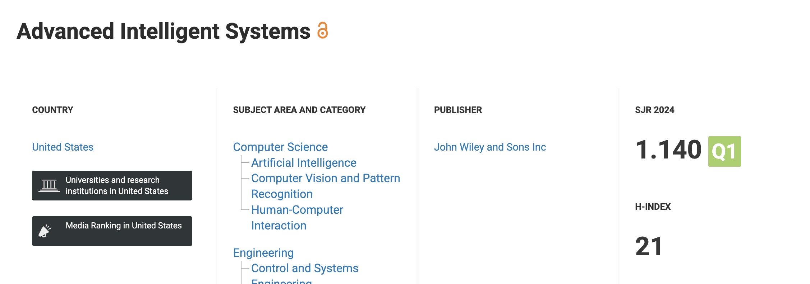
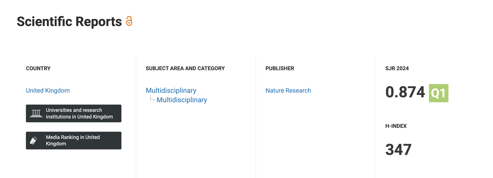
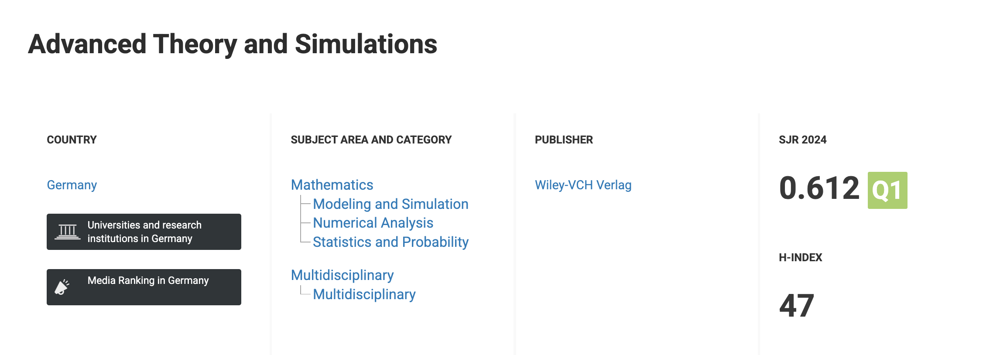
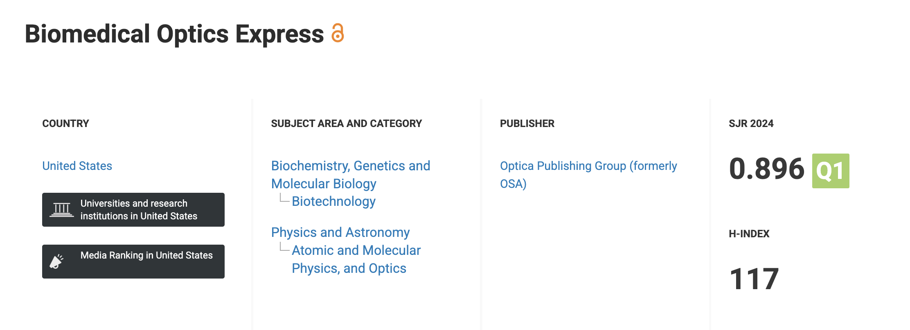

# Technical Leadership in AI/ML Research Innovation

## Mandatory Criteria - Recognition as Potential Leading Talent

### Executive Summary

I am recognized as an emerging leader in AI/ML research infrastructure, developing technical innovations that have accelerated scientific discovery across multiple international institutions. Through breakthrough computational methods and workflow optimizations, I have enabled research teams to achieve results previously impossible, establishing myself as a key technical leader in applying digital technology to advance scientific research.

### Technical Leadership Recognition

*Figure 1: Google Scholar profile showing 27+ citations across 5 publications in top-tier journals*

#### Computational Infrastructure Breakthrough

My development of the first COMSOL-HPC integration achieved a **200x simulation acceleration**, fundamentally transforming how research groups approach complex computational problems. This technical breakthrough has been adopted by researchers across Max Planck Institute, enabling PhD students and postdocs to complete simulations that previously took months in just days.

#### Multi-Institutional Demand for Expertise

Research institutions actively seek my technical leadership:

- **Max Planck Institute**: 3-year sustained collaboration (2022-2025) supported by Max Planck Society and HORIZON EUROPE European Innovation Council (EIC) Transition project HeartWise
- **Imperial College London**: Grid-Invariant AI research attracting industry interest
- **Koç University**: Machine learning applications in optical systems supported by The Scientific and Technological Research Council of Türkiye (TUBITAK) grants

This cross-institutional demand demonstrates recognition of my unique expertise in applying AI/ML to accelerate traditional research workflows.

#### Industry Recognition of Commercial Impact

My Imperial College research on Grid-Invariant AI has attracted interest from major car companies and tech giants, validating the commercial potential of my technical innovations. The 35% stability improvement achieved through my methods has direct applications in autonomous vehicle systems and large-scale AI deployments. This work is funded by a major tech giant in collaboration with multiple universities.

### Evidence of Leading Talent Potential

#### Editorial and Peer Recognition

- **Journal cover image selection** from hundreds of research submissions, demonstrating editorial board recognition of technical excellence
- **Co-first author status** with senior international researchers in top-tier journals, indicating peer acknowledgment of leadership-level contributions
- **Google Scholar Profile**: 27 citations across 5 publications demonstrating sustained research impact
- **Speaking engagement** to 50 Max Planck researchers (PhDs and postdocs) in 2022, presenting breakthrough findings

#### Research Leadership Impact

My technical innovations have directly enabled breakthrough research outputs:

- **4 peer-reviewed journal publications** in top-tier Q1-ranked journals spanning Nature Publishing Group, Wiley-VCH, and Optica Publishing Group
- **1 international conference paper** accepted through competitive peer review at premier robotics conference
- **Multiple manuscripts in development** continuing the research trajectory

*Figure 2: Advanced Intelligent Systems (Wiley-VCH) - Q1 journal ranking (SJR 1.140, top quartile in Computer Science/AI)*

*Figure 3: Scientific Reports (Nature Publishing Group) - Q1 multidisciplinary journal (SJR 0.874, H-Index 347)*

*Figure 4: Advanced Theory and Simulations (Wiley-VCH) - Q1 journal in Mathematics/Modeling (SJR 0.612)*

*Figure 5: Biomedical Optics Express (Optica Publishing Group) - Q1 journal in Optics/Biotechnology (SJR 0.896, H-Index 117)*

#### Knowledge Transfer and Mentorship

- Collaborated with PhD student Ugur Bozuyuk, transferring technical expertise that accelerated his research
- Developed computational infrastructure benefiting entire Max Planck research group
- Created workflow optimizations adopted by researchers across multiple institutions

### Digital Technology Sector Contribution

#### AI/ML Research Infrastructure

My contributions advance the digital technology sector through:

- **Computational workflow optimization** using machine learning techniques
- **High-performance computing integration** with traditional simulation software
- **Cross-disciplinary innovation** connecting AI/ML with biomedical engineering, fluid dynamics, and optical systems

#### Sustained Technical Innovation

- **2022-2025**: Continuous development of AI-enhanced research methodologies
- **Multi-domain applications**: Medical robotics, automotive systems, optical computing
- **Open-source contributions**: Making research accessible to global scientific community

This technical leadership in applying digital technology to accelerate scientific research positions me as an emerging leader with demonstrated impact across academic and industry sectors.