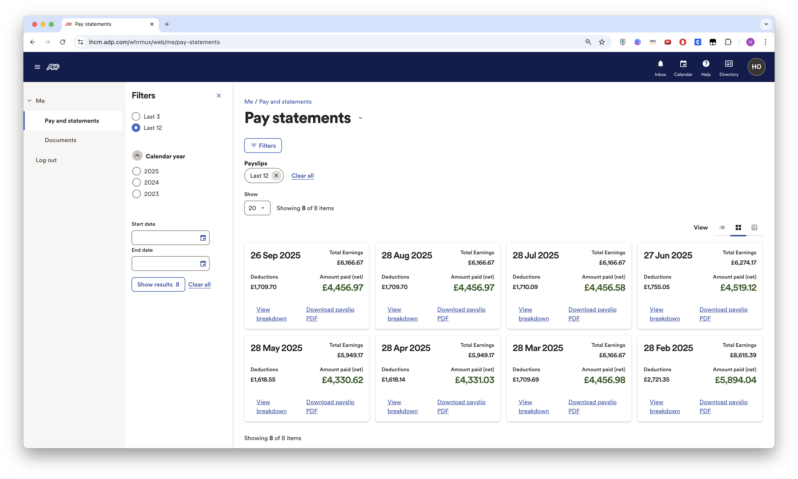

# Mandatory Criteria 2 - Market Value and Compensation

My market value is recognized through compensation significantly above the UK median. My Amazon package totals £85,250/year, which is over 2x the UK graduate median of £42,000 according to UK Graduate Labour Markets 2024. This exceptional compensation demonstrates strong market demand for my AI/ML expertise. Companies are willing to pay premium rates for my skills in RAG systems, LLM agents, and ML engineering.

_8 months of payslips averaging over £4,500/month after tax_

_UK graduate median salary: £42,000 (UK Graduate Labour Markets 2024), my compensation is 2x this baseline - UK Graduate Labour Markets 2024: https://explore-education-statistics.service.gov.uk/find-statistics/graduate-labour-markets/2024_

---

**References:**

_Amazon offer letter: £74,000 base salary_

_Amazon RSU grant: £45,000 over 4 years (£11,250/year)_
