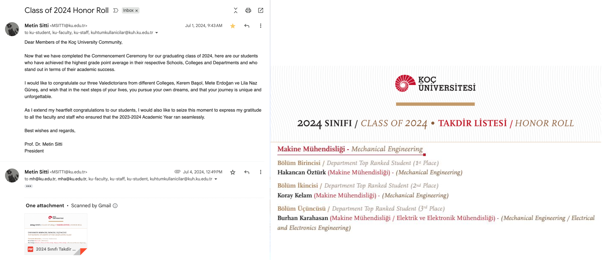
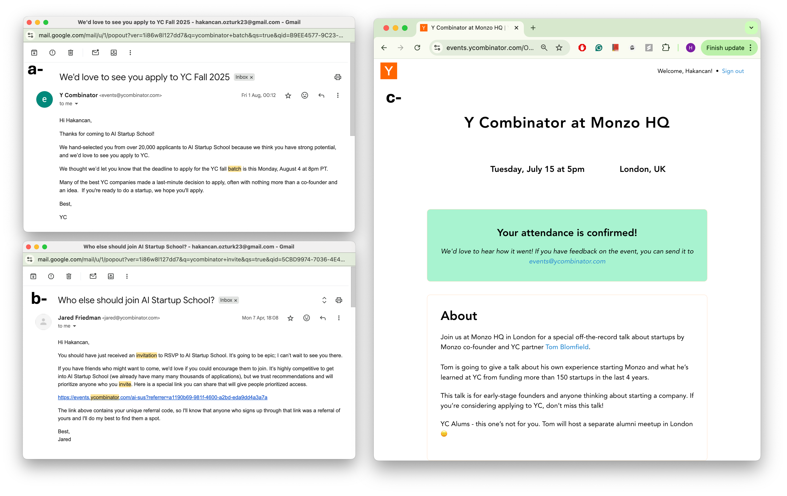
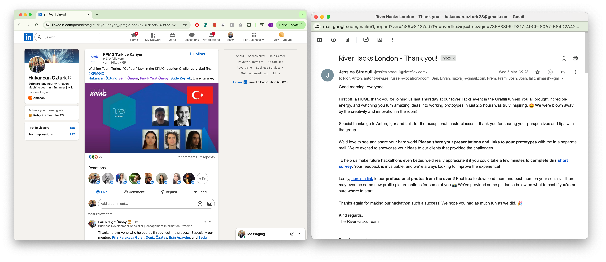

# Mandatory Criteria 3 - Academic and Competitive Recognition

I have been recognized through academic excellence and highly competitive selections that demonstrate my technical ability and innovation.

**Academic Excellence:** I ranked #1 in my Mechanical Engineering class at Koç University with a 3.99/4.00 GPA and graduated early in just 3 years instead of the standard 4.

_Ranked #1 in Mechanical Engineering, early graduation (3 years), GPA: 3.99/4.00_

**Y Combinator Selection:** I was selected for Y Combinator's AI Startup School, where only 2,000 out of 50,000+ applicants globally were accepted, a 4% acceptance rate. This led to a follow-up invitation from YC Partner Jared Friedman and exclusive access to events like the Monzo founder session.

_Top: Personal invitation from Jared Friedman (YC Partner) to apply to batch program | Middle: AI Startup School acceptance - 2,000 selected from 50,000+ applicants (4% acceptance rate) | Bottom: Exclusive invitation to YC event with Monzo founder Tom Blomfield_

**Hackathons and Competitions:** I won KPMG's National Ideation Challenge in Turkey and competed as a global finalist. At Amazon, I won the London-wide hackathon's Most Innovative Award for my LLM agent platform. I was also scouted and invited by Riverflex, a London-based company, to participate in their hackathon due to my AI/ML background.

_Left: KPMG Ideation Challenge - National Winner (Turkey) and Global Finalist | Right: Riverflex London hackathon participation_

---

**References:**

- Koç University Mechanical Engineering: https://www.ku.edu.tr/en/academics/college-of-engineering/mechanical-engineering/
- Y Combinator AI Startup School: https://events.ycombinator.com/ai-sus
- KPMG Ideation Challenge: https://www.linkedin.com/posts/kpmg-turkiye-kariyer_kpmgic-activity-6787368408221528064-hhyr
