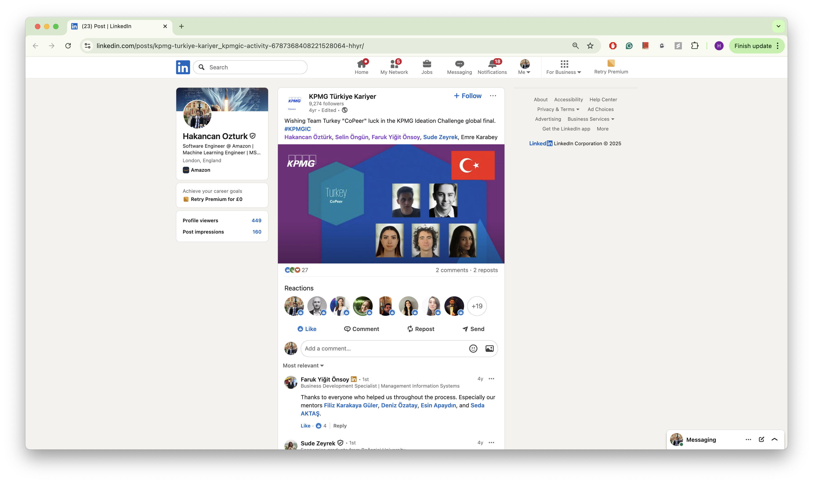
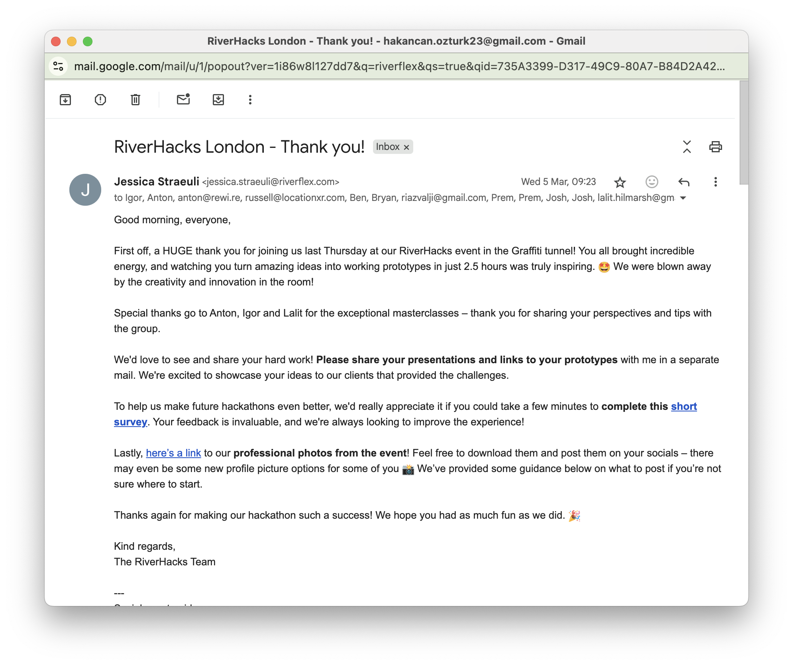

# Mandatory Criteria 3 - Competitive Recognition

I have been recognized through highly competitive selections and hackathon wins that demonstrate my technical ability and innovation. Most notably, I was selected for Y Combinator's AI Startup School - only 2,000 out of 50,000+ applicants globally were accepted, a 4% acceptance rate. This led to a follow-up invitation from YC Partner Jared Friedman and exclusive access to events like the Monzo founder session. I also won KPMG's National Ideation Challenge in Turkey and competed as a global finalist, and won Amazon's London-wide hackathon's Most Innovative Award for my LLM agent platform. These competitive achievements show consistent recognition of my work by industry leaders and elite programs.

_Y Combinator AI Startup School acceptance - 2,000 selected from 50,000+ applicants (4% acceptance rate)_

_Personal invitation from Jared Friedman (YC Partner) to apply to the batch program_

_Exclusive invitation to YC event with Monzo founder Tom Blomfield_

_KPMG Ideation Challenge - National Winner (Turkey) and Global Finalist_

_Riverflex London hackathon invitation_
