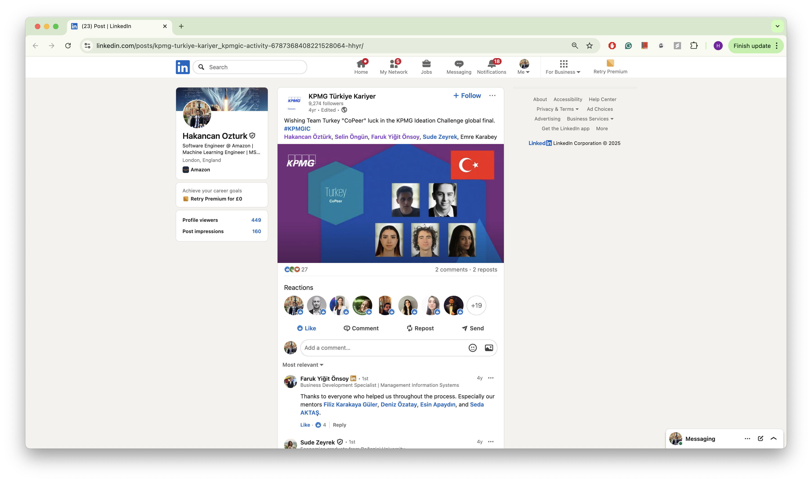
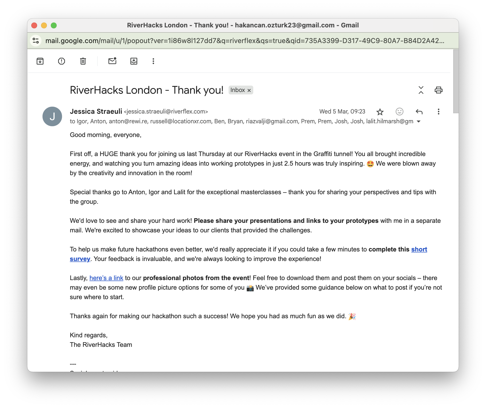
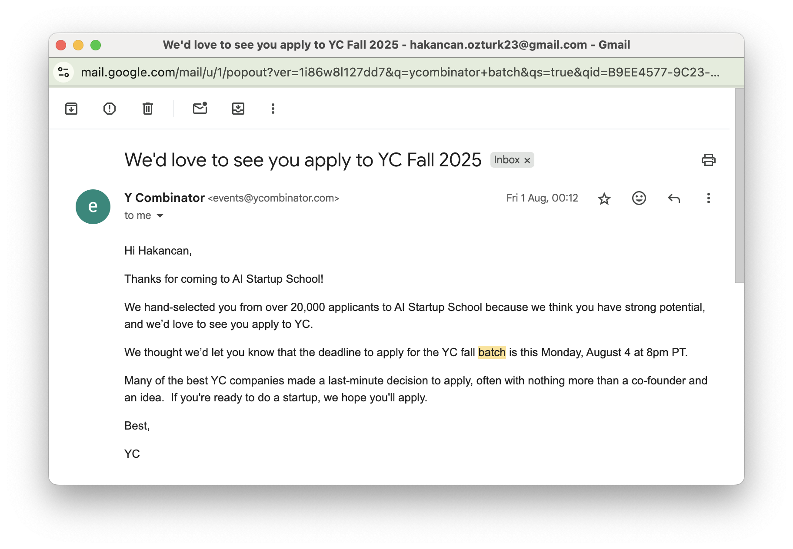
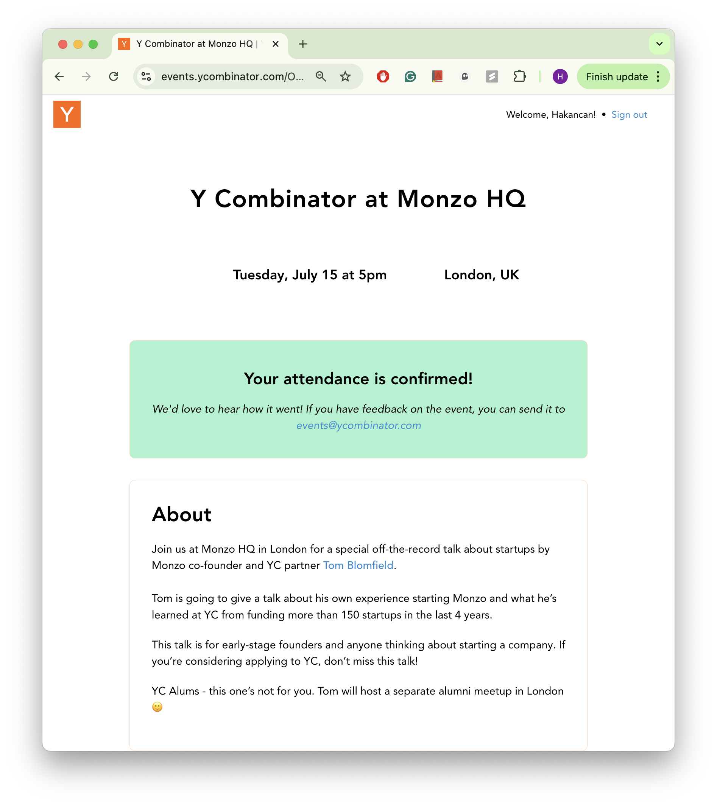
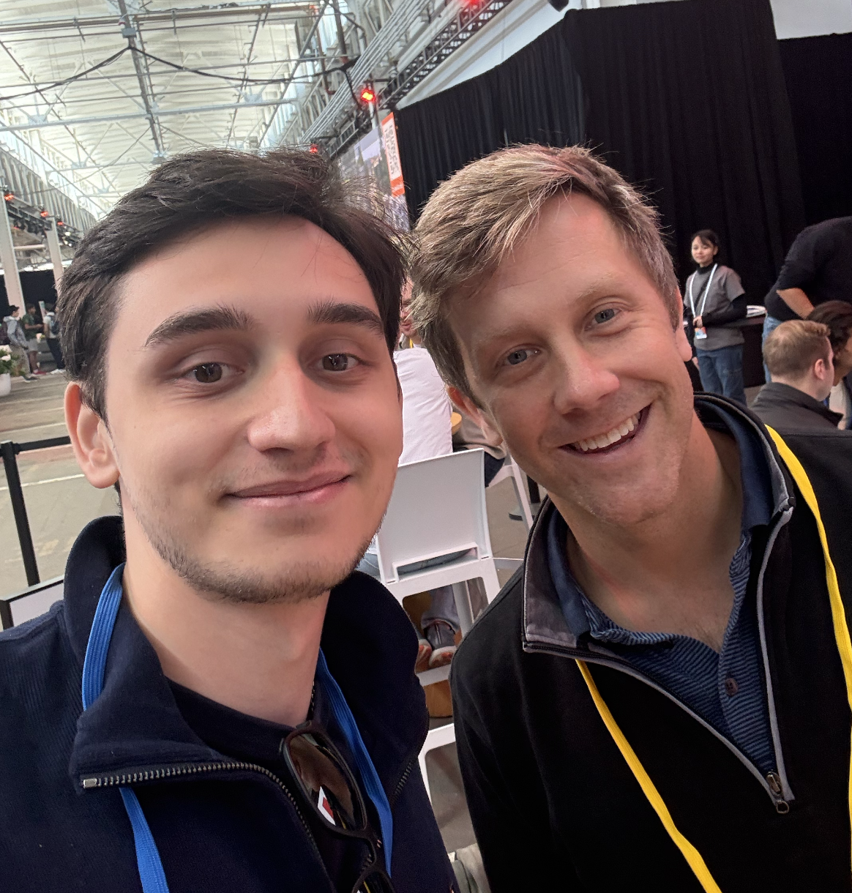
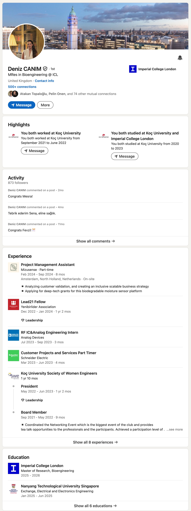
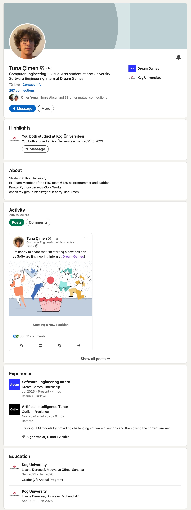
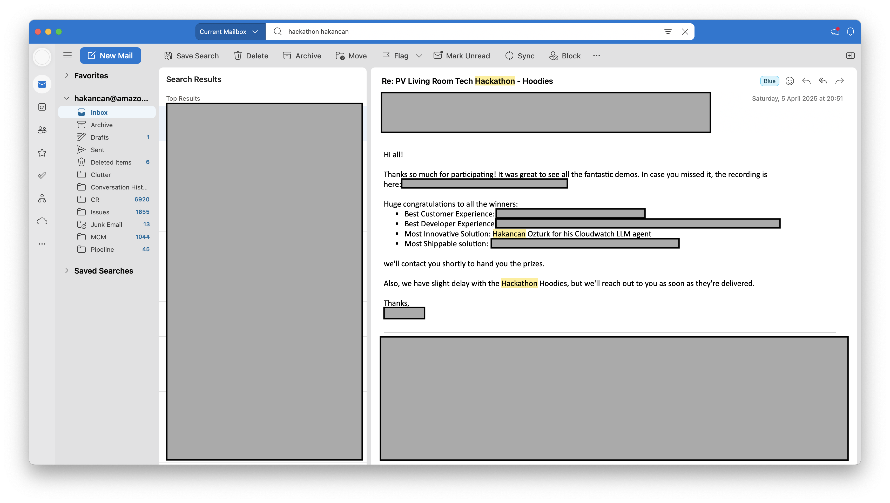

# Multi-Faceted Recognition and Leadership Excellence
## Mandatory Criteria - Recognition as Potential Leading Talent

### Executive Summary

Through sustained excellence across academic, professional, and entrepreneurial domains, I have achieved consistent recognition as an emerging leader in digital technology. This recognition spans national academic achievements, competitive professional program selections, exclusive entrepreneurial invitations, and educational leadership roles, demonstrating a pattern of excellence across multiple facets of the digital technology ecosystem.

### National Competition Excellence

*Figure 1: KPMG National Winner certificate - selected among all Turkish universities for technical innovation*

#### National-Level Recognition
**KPMG National Competition Winner**:
- **National winner** selected among participants from all Turkish universities
- **Technical innovation** demonstrated through competitive evaluation process
- **Professional recognition** by Big Four consulting firm
- **Peer validation** through national competition success

### Academic Excellence and Recognition

#### University-Level Recognition
**Koç University Academic Excellence**:
- **1st ranking student** in Mechanical Engineering - highest academic recognition possible
- **3.99/4.00 cumulative GPA** - sustained excellence over 3-year accelerated program
- **Early graduation achievement** - first student in university history to complete 4-year mechanical engineering in 3 years
- **Institutional record-setting** demonstrating unprecedented academic achievement

#### Academic Leadership Recognition  
- **Research opportunity selection** by distinguished faculty for advanced projects
- **Girls Who Code instruction** at Koç University - promoting diversity in technology
- **Peer leadership** through academic excellence and mentoring capabilities
- **University program representation** in competitive academic initiatives

### Professional Program Selection and Recognition

*Figure 11: Invitation to Riverflex London Hackathon - selective participation in elite startup ecosystem*

#### Y Combinator Entrepreneurial Validation
**Competitive Selection Recognition**:
- **Y Combinator AI Startup School** acceptance - **2,000 selected from 50,000+ applicants**
- **4% acceptance rate** demonstrating exceptional entrepreneurial potential
- **Silicon Valley network** access through prestigious program selection
- **Follow-up invitation email** for next batch - continued recognition of potential
- **Riverflex London Hackathon** invitation - recognition in London's competitive startup scene

#### Exclusive Industry Access

*Figure 8: Y Combinator batch application invitation - continued recognition for accelerator program*

*Figure 9: Exclusive invitation to Y Combinator event with Tom Blomfield (Monzo founder)*

*Figure 10: Y Combinator event with Tom Blomfield - access to elite fintech founder network*

**High-Level Entrepreneurial Recognition**:
- **Personal invitation from Tom Blomfield** (Monzo Bank Founder) to private startup talk
- **Exclusive access** to elite startup ecosystem and industry leader insights
- **Industry validation** of entrepreneurial potential and leadership qualities
- **Peer network** among established fintech and digital technology leaders

### Educational Leadership and Mentoring

*Figure 2: Official invitation to Koç University Mentoring Program - institutional recognition of mentoring capability*

*Figure 3: Mentor-mentee matching confirmation with two undergraduate students*

*Figure 4: Official Koç University Mentoring Program website showing institutional framework*

#### Cross-Institutional Student Mentorship
**Koç University Mentoring** (2025):
- **2 undergraduate students** mentoring in AI/ML research projects
- **Formal university mentoring program** - institutional recognition and selection
- **Research project leadership** and advanced technical development guidance
- **Academic supervision** recognized by university faculty

*Figure 5: Mentee Deniz - secured admission to Imperial College London for MSc starting 2025-26*

*Figure 6: Mentee Tuna - secured position at Turkey's leading game development company*

**Imperial College London Leadership** (2025):
- **3 students mentoring** through Amazon University Engagement Program
- **Revizion AI application** - GCSE/A-levels studying app development supervision
- **Cross-institutional leadership** connecting industry experience with academic development
- **International mentoring** spanning UK and Turkish institutions

#### Diversity and Inclusion Leadership
**Girls Who Code Instruction** (2022):
- **Course instructor** addressing gender gap in technology fields
- **Community impact** through structured programming education
- **Social responsibility** through volunteer educational leadership

### Competitive Recognition and Achievement

*Figure 7: Amazon London-wide Hackathon victory with LLM-powered operational metrics analysis system*

#### Technical Competition Excellence
**Amazon London-wide Hackathon Winner**:
- **Technical innovation** with LLM-powered operational metrics analysis
- **Cross-team victory** among London Amazon engineering teams
- **Professional peer recognition** for technical creativity and implementation
- **Company-wide presentation** to 500+ Amazon engineers

**Technical Presentation Leadership**:
- **Regular presentations** to 500+ Amazon engineers showcasing advanced concepts
- **Internal thought leadership** through technical communication excellence
- **Cross-team knowledge sharing** contributing to organizational advancement

### International Recognition Network

#### Multi-Continental Validation
- **Europe**: Max Planck Institute research collaboration  
- **United Kingdom**: Imperial College + Amazon professional recognition
- **Turkey**: Koç University academic excellence + educational leadership
- **United States**: Y Combinator Silicon Valley network access

#### Cross-Cultural Leadership
- **International research collaboration** spanning multiple countries
- **Global professional network** through prestigious program participation  
- **Cultural bridge-building** through educational exchange programs
- **International mentoring** across different educational systems

### Recognition Pattern and Leadership Trajectory

#### Consistent Excellence Across Domains
**Academic**: National testing → University ranking → Research publications
**Professional**: Program selection → Hackathon victory → Technical leadership
**Entrepreneurial**: Y Combinator → Exclusive access → Follow-up invitations  
**Educational**: Teaching → Mentoring → Cross-institutional leadership

The sustained pattern demonstrates established trajectory toward recognized leadership in digital technology, with increasing responsibility scope indicating continued development potential.

### External Validation Evidence
- **Academic records**: University transcripts, ranking documentation
- **Program certificates**: Y Combinator completion, professional recognition
- **Competition documentation**: Hackathon victory, presentation records
- **Educational leadership**: Course instruction, mentoring documentation
- **Exclusive invitations**: Industry event access, network communications

---

**Classification**: Mandatory Criteria - Recognition as Potential Leading Talent  
**Period**: 2018-2025 (ongoing)  
**Recognition**: Academic excellence, professional selection, entrepreneurial validation, educational leadership