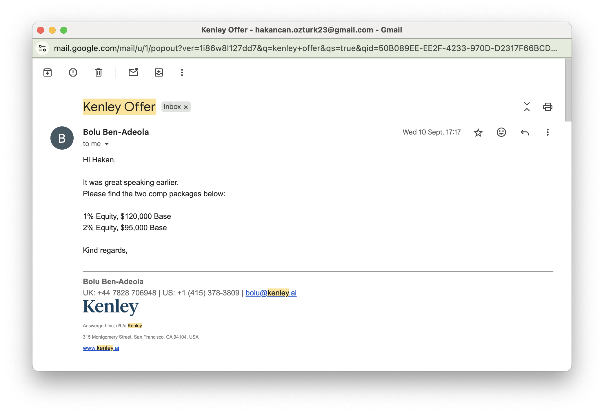
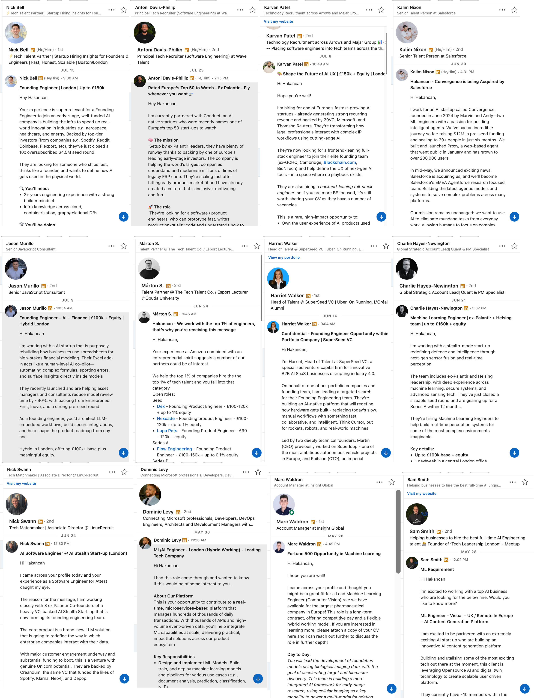
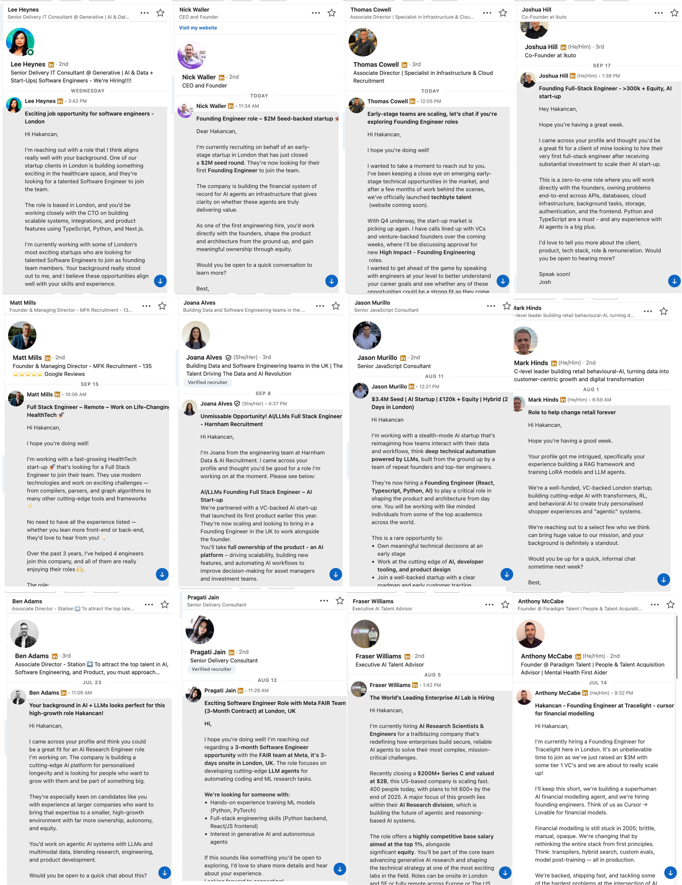

# Mandatory Criteria 4 - Industry Demand for Expertise

There is significant market demand for my AI/ML expertise, demonstrated through unsolicited inbound interest from recruiters and entrepreneurs. After completing Y Combinator AI Startup School, I received numerous approaches from startup recruiters on LinkedIn seeking technical cofounders for AI companies. On the YC Cofounder matching platform, on average 10 people reach out daily wanting me to be their cofounder. I've also received direct startup offers, including one for $120,000 base salary plus 1% equity. This consistent inbound interest shows strong market recognition of my expertise in AI agents, RAG systems, and ML engineering, all high-demand areas in the current technology landscape.

_Direct startup offer: $120,000 base + 1% equity_

**References:**

- Y Combinator AI Startup School: https://events.ycombinator.com/ai-sus
- Kenley Technologies: http://kenley.ai/

_Unsolicited LinkedIn recruiter messages seeking technical cofounders for AI startups_

_Continued inbound recruiter interest for cofounder positions_

_18 people reached out in 2 days on YC Cofounder platform wanting to start companies together_
