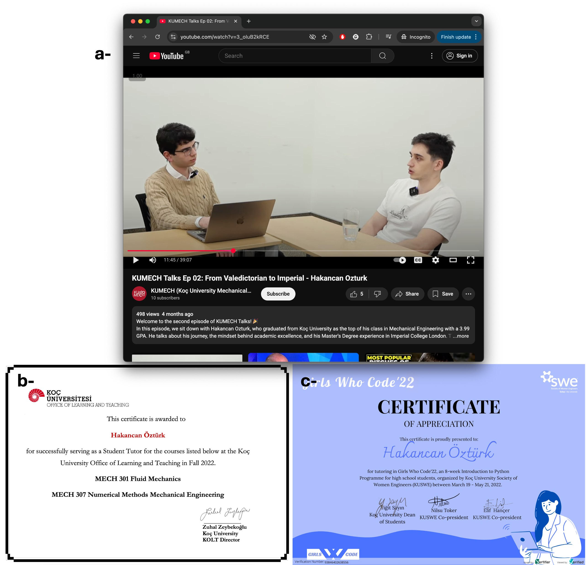
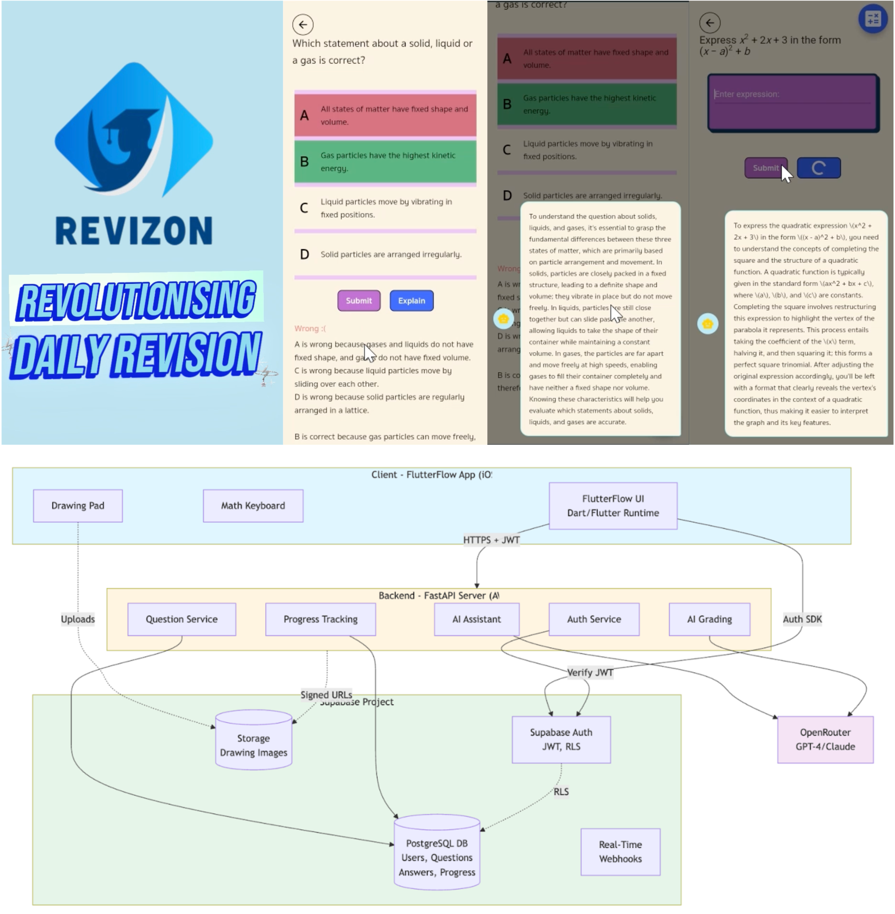

# Mandatory Criteria 5 - Educational Leadership and Mentoring

I have contributed to developing the next generation of technologists through formal mentoring, teaching, and public engagement.

**Public Engagement and Teaching:** I've shared my knowledge through a Koç University podcast on UK tech careers that reached 500+ viewers on YouTube. I've tutored university courses (Fluid Dynamics and Engineering Computational Methods at Koç) and participated in the Girls Who Code program, teaching high school girls from low-income regions of Turkey to help address the gender gap in tech.

_a) Koç University Mechanical Engineering Society podcast on UK tech careers - 500+ YouTube views | b) University course tutoring certificate for Fluid Dynamics and Numerical Methods | c) Girls Who Code certificate - tutoring and preparing Python programming course material for high school girls_

**Koç University Mentoring:** Through Koç University's official mentoring program, I mentored 2 students with documented successful outcomes. One was accepted to Imperial College London for her MSc (starting 2025-26) and the other secured a position at Turkey's leading game development company.

_a) Email showing 2 mentee matches | b) Mentorship network website structure | c) Tuna's LinkedIn - secured position at Turkey's leading game development company | d) Deniz's LinkedIn - accepted to Imperial College London MSc (2025-26)_

**Amazon University Engagement Program:** I mentor 3 Imperial College students through Amazon's University Engagement Program, guiding them in building Revizon, an AI-powered study app for GCSE and A-level students.

_Top: UI screenshot | Bottom: High-level system design diagram of mobile app - AI-powered GCSE/A-levels study app, mentoring 3 Imperial College students through Amazon University Engagement Program_

---

**References:**
- KUMech Podcast: https://www.youtube.com/watch?v=3_oIuB2kRCE&t=704s
- Koç Mentor Alumni Network: https://mezun.ku.edu.tr/en/programs/alumni-mentorship-network
- Girls Who Code Program: https://gshs.ku.edu.tr/en/news/?detail=true&id=02b2ff30-a44f-4947-89ea-ce9a72a5f88c
- Deniz Canim (Mentee): https://www.linkedin.com/in/deniz-canim/
- Tuna Çimen (Mentee): https://www.linkedin.com/in/tuna-%C3%A7imen-76b273193/
