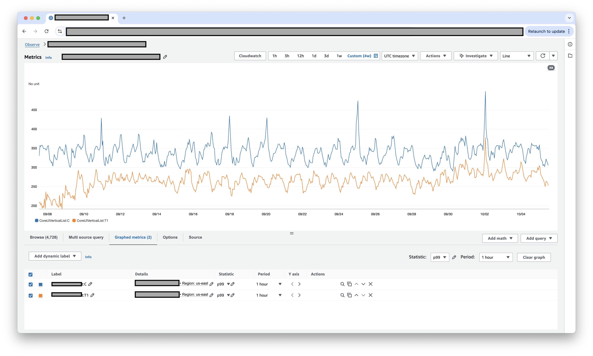
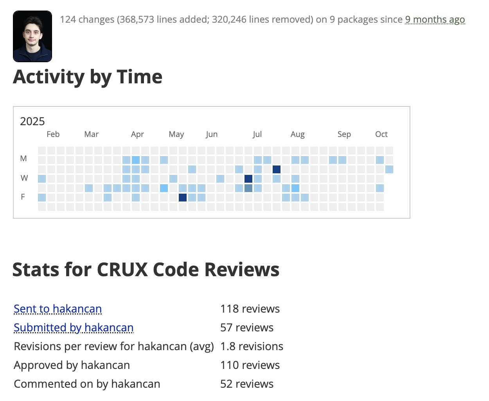
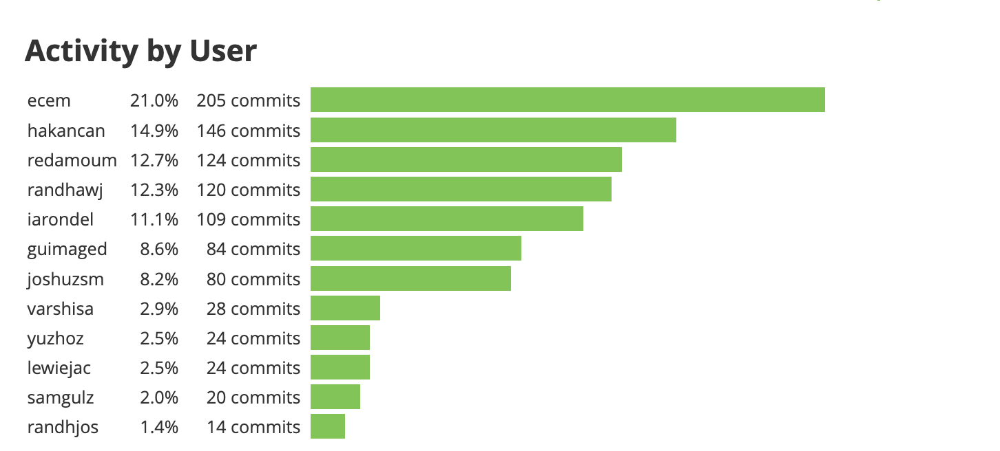

# Optional Criteria 3.1 - Amazon Prime Video Performance Optimization

Prime Video has hundreds of millions of customers all over the world, more than 1% of the world's population runs my code. Even customers with low-end devices want to enjoy smooth streaming, so performance is critical to the business. I worked on making the app run faster and smoother by optimizing the user interface components at the backend level. My performance optimization projects are driving eight-figure revenue impact for Prime Video.

---

_UI processing time comparison showing the difference between control (legacy) and T1 (improved) groups. I achieved a 20% reduction in UI rendering time and 4% memory optimization across 200M+ devices, meaning millions of customers now enjoy a faster, more responsive app._

_Over 140 changes with 370K+ lines added and 320K+ lines removed during 10 months at Amazon Prime Video_

_I am the second top contributor on the team, ranked after the most senior engineer, with 146 commits during my tenure._

---

**Key numbers:** 20% UI rendering time reduction for 100M+ Prime Video customers • 4% memory optimization for 200M+ devices • Over 1% of world population runs my code • 120+ changes with 360K+ lines added, 320K+ lines removed • Increased revenue and user retention through improved performance

---

**Note:** Due to confidentiality, I cannot share additional internal documents including detailed impact numbers and revenue metrics.
