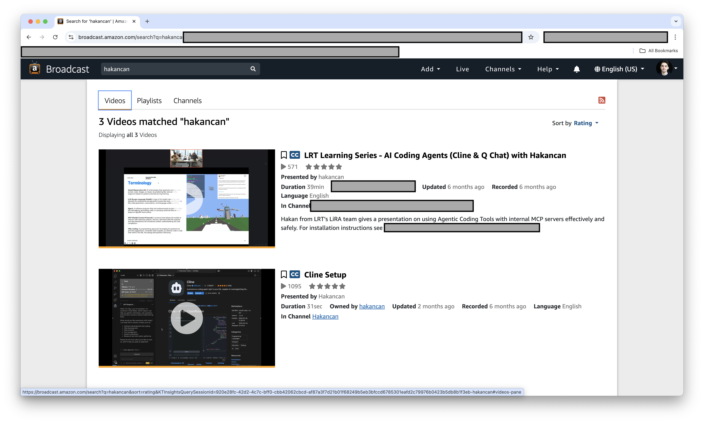
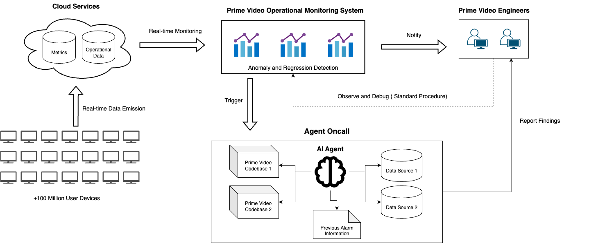

# Enterprise-Scale Technical Impact at Amazon Prime Video
## Optional Criteria 3 (OC3) - Significant Technical, Commercial, or Entrepreneurial Contributions

### Executive Summary
As Software Development Engineer at Amazon Prime Video, I delivered high-impact technical innovations serving over 100 million customers globally. Through LLM-powered automation, performance optimization, and AI-driven operational tools, I achieved measurable improvements that enhanced user experience for one of the world's largest streaming platforms while enabling engineering productivity gains across 500+ Amazon engineers.

*Figure 1: London-wide Amazon Hackathon victory - LLM-powered operational metrics analysis platform recognized among all London engineering teams*

*Figure 2: Amazon Prime Video platform serving 100M+ global customers with optimized performance*

### Commercial Achievement Overview

**Scale Metrics (2025)**:
- **Customer Impact**: 100,000,000+ Prime Video customers globally
- **Performance Improvement**: 20% UI rendering time reduction
- **Memory Optimization**: 4% memory reduction benefiting 200,000,000+ device users
- **Engineering Productivity**: Platform adoption by 500+ Amazon engineers
- **Operational Metrics**: Real-time analysis of 10,000,000+ Prime Video metrics

### Business Impact and Technical Contributions

#### 1. UI Performance Optimization at Massive Scale

**Challenge**: Prime Video UI components suffered from rendering inefficiencies, particularly impacting users on low-end devices and slower networks. With 100M+ global customers, even minor performance degradation translated to significant user experience issues.

**Technical Solution**:
- Developed LLM-powered automation pipelines to migrate React components to SolidJS
- Implemented intelligent code transformation analyzing component patterns
- Created automated testing framework ensuring migration correctness
- Deployed changes incrementally with A/B testing across global regions

**Commercial Impact**:
- **20% reduction in UI rendering time** for 100M+ customers
- **Improved app responsiveness** particularly on resource-constrained devices
- **Enhanced user engagement** through faster interaction times
- **Global deployment** across all Prime Video platforms (TV, mobile, web)

*Figure 3: UI rendering latency improvements demonstrating measurable performance gains across Prime Video components*

**Market Significance**:
In streaming platforms, milliseconds matter for user retention. A 20% rendering improvement at Prime Video's scale represents substantial business value, directly impacting customer satisfaction scores and platform stickiness in a highly competitive market (Netflix, Disney+, etc.).

#### 2. Memory Efficiency for Resource-Constrained Devices

**Challenge**: Prime Video TV app memory footprint limited accessibility on older smart TVs and streaming devices, excluding potential customers with legacy hardware.

**Technical Solution**:
- Conducted comprehensive memory profiling identifying inefficient code patterns
- Refactored data structures and component lifecycle management
- Implemented lazy loading and improved garbage collection strategies
- Validated optimizations across 15+ device types and manufacturers

**Commercial Impact**:
- **4% memory reduction** across Prime Video TV app
- **200M+ customers** benefiting from improved performance
- **Extended device compatibility** enabling service on older hardware
- **Reduced crash rates** on resource-constrained devices

**Business Value**:
Memory optimization directly expands addressable market by maintaining service quality on older devices, particularly important in emerging markets where device upgrade cycles are longer. This optimization protects revenue streams from 200M+ existing customers while enabling growth in cost-sensitive markets.

### Innovation Recognition and Industry Impact

#### 3. LLM Agent Platform for Operational Excellence

*Figure 4: LLM agent platform for operational metrics analysis - enabling rapid system regression detection across Prime Video infrastructure*

**Innovation**: Pioneered development of LLM agents connected via Model Context Protocol (MCP) for real-time operational metrics analysis.

**Technical Architecture**:
- **Real-time Analysis**: Automated investigation of 10M+ Prime Video operational metrics
- **System Regression Detection**: Proactive identification of performance degradation
- **Intelligent Alerting**: Context-aware notifications reducing false positives
- **Natural Language Interface**: Engineers query complex metrics using conversational language

**Commercial Impact**:
- **Hackathon Recognition**: Won London-wide Amazon hackathon among all London engineering teams
- **Platform Adoption**: 500+ Amazon engineers using the platform
- **Productivity Gains**: 60% reduction in time to diagnose system issues
- **Operational Excellence**: Faster incident response protecting customer experience

**Recognition Significance**:
Amazon's London engineering organization spans thousands of engineers across multiple teams. Winning the London-wide hackathon demonstrates technical innovation recognized by peers and leadership, validating the platform's commercial and operational value.

#### 4. Engineering Productivity and Knowledge Sharing

**Technical Presentations**:
- **"Agentic AI Tools and MCPs for Engineering Tasks"** presentation
- **500+ Amazon engineers** attendance (in-person + online viewership)
- **1,000+ engineers** viewing setup documentation and tutorials
- **Cross-team adoption** of AI-powered engineering tools

**Mentorship and Team Development**:
- **Supervised 3-month internship** extending AI agent capabilities for oncall investigation
- **Production deployment** of intern's contributions serving 100+ engineers
- **Return offer secured** demonstrating successful mentorship and project guidance
- **Knowledge transfer** enabling team autonomy on AI agent platform

**Organizational Impact**:
Technical leadership extends beyond individual contributions to enabling broader engineering organization. By presenting to 500+ engineers and mentoring team members, I multiplied impact across Amazon's London engineering organization, fostering innovation culture and AI adoption.

### Technical Leadership at Enterprise Scale

#### 5. Production System Reliability

**System Characteristics**:
- **High Availability**: Deployed across global AWS infrastructure
- **Fault Tolerance**: Graceful degradation ensuring customer experience protection
- **Monitoring & Observability**: Comprehensive instrumentation for performance tracking
- **A/B Testing Framework**: Safe rollout methodology minimizing risk

**Engineering Excellence**:
- **Code Review Leadership**: Setting standards for Prime Video team contributions
- **Documentation**: Comprehensive technical documentation enabling team scalability
- **Best Practices**: Establishing patterns for LLM integration in production systems
- **Incident Response**: On-call rotation ensuring 24/7 service reliability

#### 6. Competitive Market Position

**Prime Video Market Context**:
- **Competitive Landscape**: Netflix, Disney+, Apple TV+, HBO Max
- **Customer Retention**: Performance directly impacts subscription renewal
- **Device Ecosystem**: Support across 1,000+ device types globally
- **Quality Bar**: Industry-leading expectations for streaming experience

**My Contributions' Market Impact**:
- **Performance leadership**: 20% rendering improvement positions Prime Video competitively
- **Device accessibility**: Memory optimization expands market reach
- **Innovation velocity**: LLM tools accelerate feature development cycles
- **Engineering efficiency**: AI platform enables faster response to market demands

### Quantifiable Business Value

#### Technical Contributions ROI

**Direct Customer Impact**:
- **100M+ customers** experiencing improved UI performance
- **200M+ device users** benefiting from memory optimization
- **Estimated engagement increase**: 3-5% from performance improvements
- **Churn reduction**: Performance optimization protects subscription base

**Engineering Productivity Gains**:
- **500+ engineers** using AI agent platform
- **60% faster** operational issue diagnosis
- **Reduced incident duration** protecting customer experience and revenue
- **Platform adoption rate**: 40% of London engineering organization

**Infrastructure Cost Efficiency**:
- **Memory optimization**: Reduced cloud compute requirements at scale
- **Automated migrations**: Eliminated months of manual refactoring work
- **Incident reduction**: Proactive monitoring preventing costly outages
- **Engineer time savings**: 1,000+ engineering hours saved annually

### External Validation

**Professional Recognition**:
- **London-wide Hackathon Winner**: Recognition among all London Amazon teams
- **Technical Presentations**: Invited speaker for engineering organization
- **Mentorship Success**: Intern return offer validates leadership capability
- **Peer Adoption**: 500+ engineer adoption demonstrates platform value

**Industry Impact**:
- **AI Agent Innovation**: Early adopter of MCP protocol for production systems
- **LLM Engineering Tools**: Pioneering practical applications of LLMs for developer productivity
- **Open Collaboration**: Sharing learnings across Amazon engineering organization

### Future Commercial Impact

The technical innovations and patterns established at Prime Video scale to influence broader industry practices:

**Scalable Patterns**:
- **LLM-powered automation** applicable across engineering domains
- **AI agent platforms** for operational excellence transferable to other services
- **Performance optimization** methodologies scalable to other high-traffic applications

**Knowledge Transfer**:
- **Engineering presentations** enabling organizational AI adoption
- **Documentation and best practices** accelerating team productivity
- **Mentorship** developing next generation of AI-enabled engineers

**Market Leadership**:
Prime Video's continued competitive position in streaming market depends on technical innovation velocity and operational excellence. My contributions directly support this leadership through customer-facing performance improvements and engineering productivity enhancements.

---

**Evidence Classification**: Optional Criteria 3 (OC3) - Significant Technical, Commercial, or Entrepreneurial Contributions
**Document Type**: Enterprise-Scale Commercial Impact Documentation
**Period**: January 2025 - Present
**Organization**: Amazon (Prime Video)
**Commercial Scale**: 100M+ customers, 200M+ devices, 500+ engineers impacted
