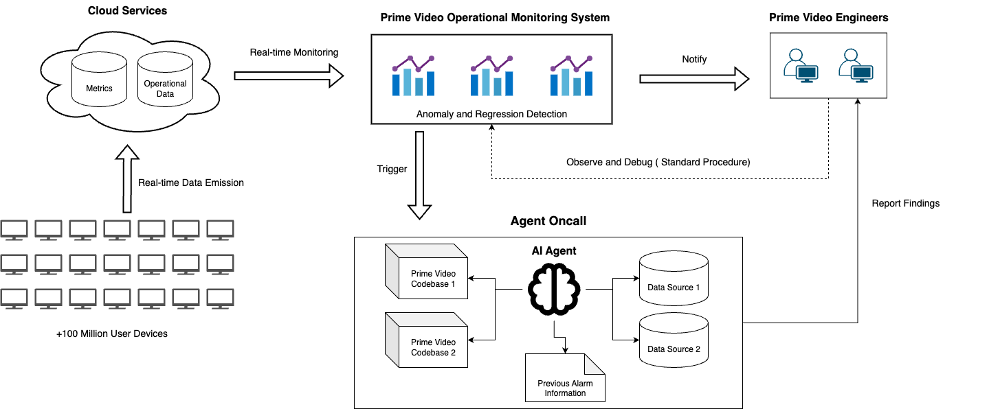
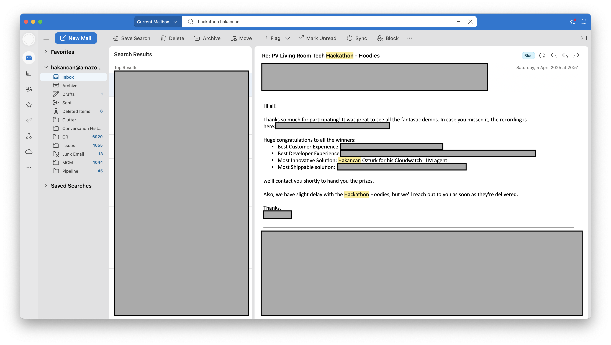
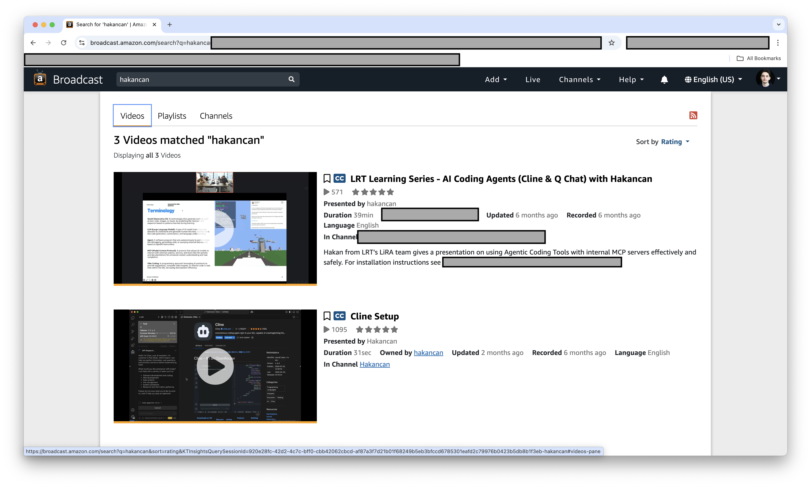

# Optional Criteria 3.2 - Amazon Prime Video LLM Agent Platform

The oncall process at Amazon is critical because tens of millions of customers are watching Prime Video at all times, so when something goes wrong, engineers need to diagnose and fix issues quickly. This task is extremely difficult and repetitive because engineers have to manually sift through 10M+ operational metrics in CloudWatch to identify root causes. I saw this problem firsthand and built an LLM agent platform that automatically analyzes these metrics in real-time and provides diagnosis suggestions. The platform won Amazon's London-wide hackathon's Most Innovative Award and is now used in production for internal ticket resolution. I also received an Imperial College intern to work on this project - she built upon my work and received a return offer from Amazon.

---

*High-level architecture of the LLM agent platform I built for automated operational metrics analysis*

*Most Innovative Solution Award - Amazon London-wide hackathon for my Cloudwatch LLM agent*

*My presentation videos watched by 500+ Amazon engineers explaining the agent architecture and MCP integration*

---

**Key numbers:** Real-time analysis of 10M+ Prime Video operational metrics • Used in production for internal tickets • 60% faster operational issue diagnosis • Won Most Innovative Award (London-wide hackathon) • Imperial College intern hired to extend the project
