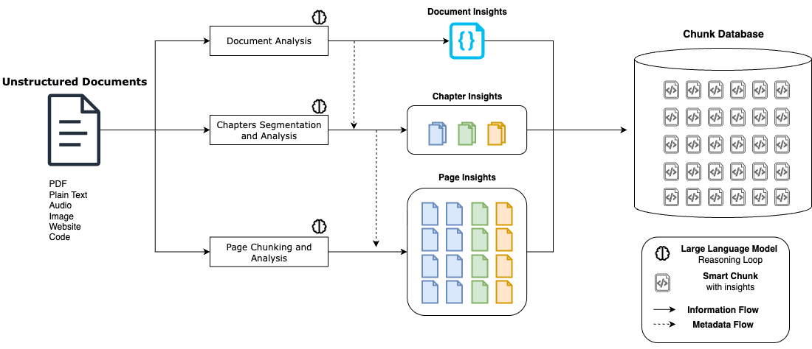
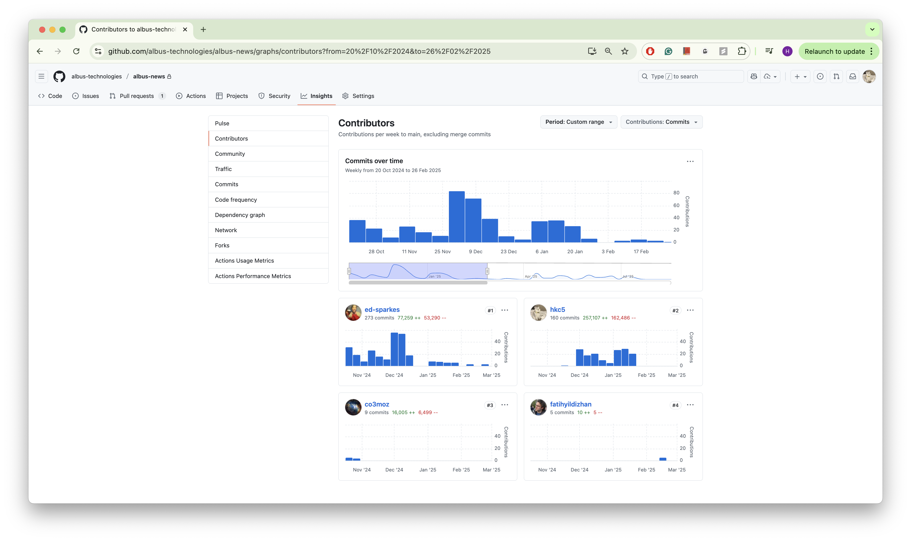

# Optional Criteria 3.3 - Albus Technologies Engineering Contributions

RAG systems face a fundamental engineering problem - how do you split documents into chunks for semantic search? The industry standard, LangChain, uses arbitrary character-based splitting which breaks context and ruins retrieval quality. At Albus, I saw this problem destroying our document intelligence product, so I designed and built a hierarchical semantic chunking architecture from scratch. Instead of blindly cutting text every N characters, my system understands document structure (headers, paragraphs, sections) and creates semantically meaningful chunks. The architecture uses a multi-layer approach: first splitting by document structure, then using embedding similarity to determine optimal chunk boundaries, and finally maintaining parent-child relationships for context preservation. This was such an effective solution that users willingly accepted 30x slower processing time because they cared more about the 2x improvement in accuracy. As the top contributor with 160 commits to the main services repository, I built the entire backend infrastructure - the document processing pipeline, the embedding generation system, the vector database integration with Pinecone, and the semantic search API that handles millions of queries. The system processes multiple document modalities (PDF, audio, code, images) and orchestrates AWS Lambda functions for parallel processing.

---

*High-level architecture of the hierarchical semantic chunking system I designed - solves LangChain's arbitrary splitting problem*

*160 commits - second most frequent contributor to main services repository*

*Top contributor on keyword search repository*

---

**Key numbers:** 160 commits as top contributor • Designed hierarchical chunking architecture from scratch • 30% better retrieval than LangChain baseline • 2x accuracy improvement vs character-based splitting • Multi-layer approach (structure → embeddings → relationships) • Built document processing pipeline for multiple modalities (PDF, audio, code, images) • Integrated Pinecone vector database • AWS Lambda orchestration for parallel processing • 6 months from concept to production
