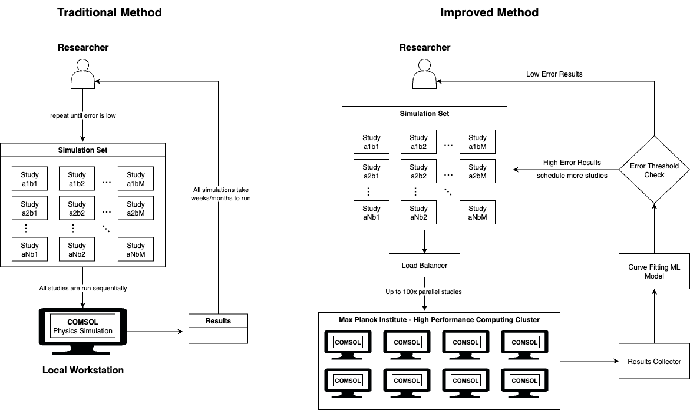
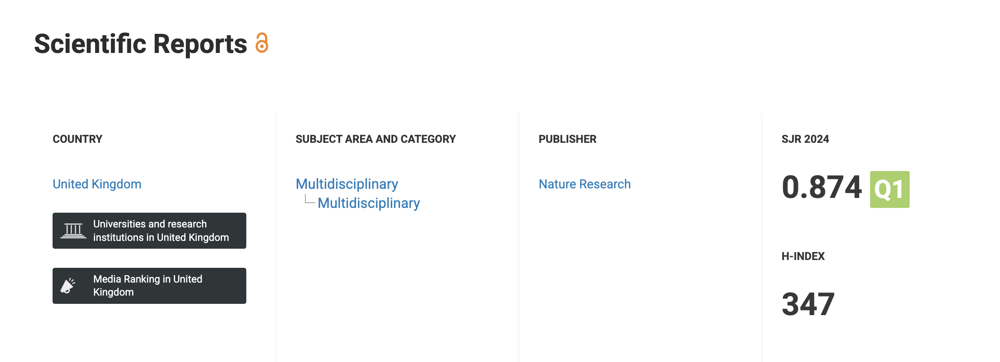
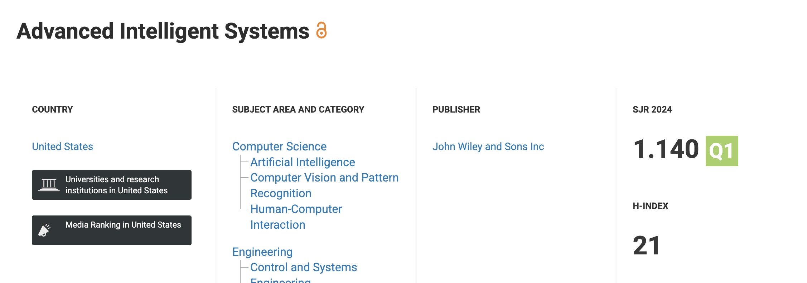
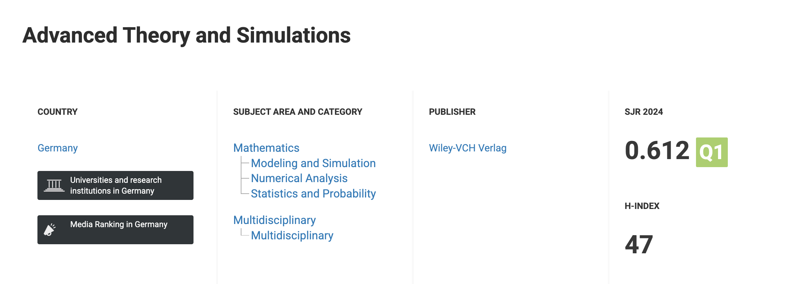
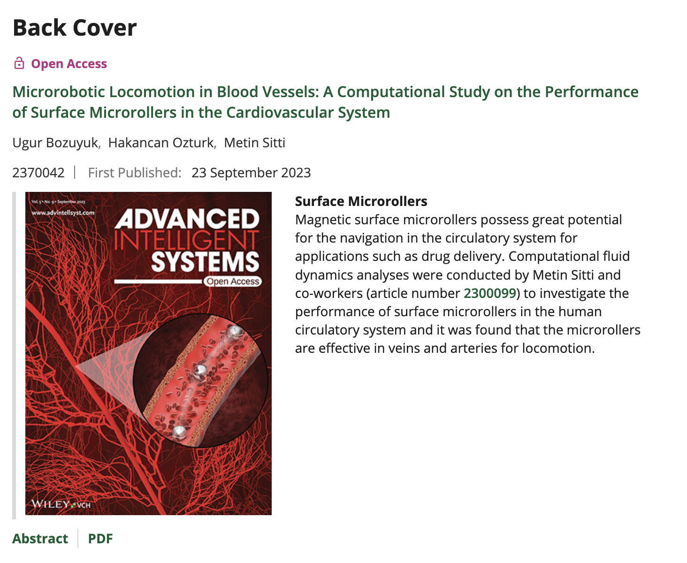

# Optional Criteria 4.1 - Computational Physics Research at Max Planck Institute

During my research fellowship at Max Planck Institute for Intelligent Systems (2022), I was bound by the time it took to run CFD simulations on COMSOL, a physics simulation software. Running these simulations on local workstations took weeks or months, which severely limited our research velocity. I decided to move the entire testing suite to the Max Planck high-performance computing platform. This required extensive coordination - I had multiple meetings with the IT team to set up COMSOL on Linux and integrate it with the institute's job scheduling system. I then developed an ML-based job scheduling system that helps conduct CFD studies in a smarter way, achieving 200x faster data population. This breakthrough enabled 3 high-impact journal publications and 1 conference paper where I was co-first author on 2 of them. The papers have received over 25 citations and the number is increasing every day. After seeing my results, other PhD candidates at the lab across Germany also adopted my methodology and used the wiki page I created to replicate the setup.

---

*High-level architecture of the HPC framework I developed - integrated COMSOL with Max Planck's job scheduling system*

*Nature Scientific Reports publication (Impact Factor: 3.9, h-index: 347) - co-first author*

*Advanced Intelligent Systems journal cover featuring my research (Impact Factor: 6.8, h-index: 21) - co-first author*

*Advanced Theory and Simulations publication (Impact Factor: 2.9, h-index: 47) - co-author*

*Advanced Intelligent Systems back cover featuring my microrobotics research*

---

**Key numbers:** 200x simulation speedup • 4 publications (3 journals + 1 conference) • 2 co-first author papers • 25+ citations and growing • Journal cover selection • Methodology adopted by PhD candidates across Germany • Created wiki documentation used by other researchers • Reduced simulation time from months to days
