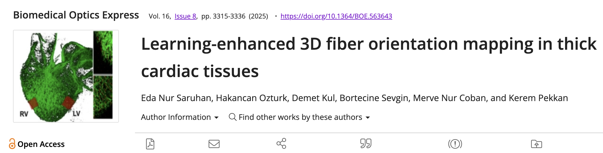
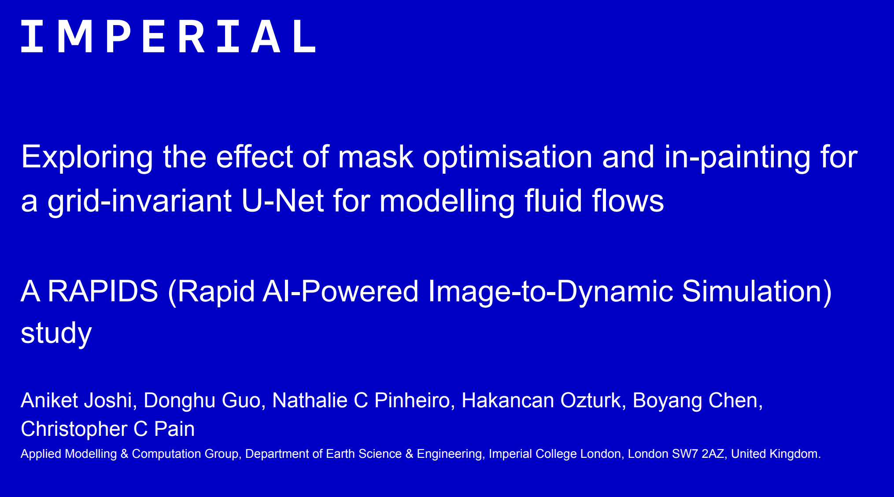
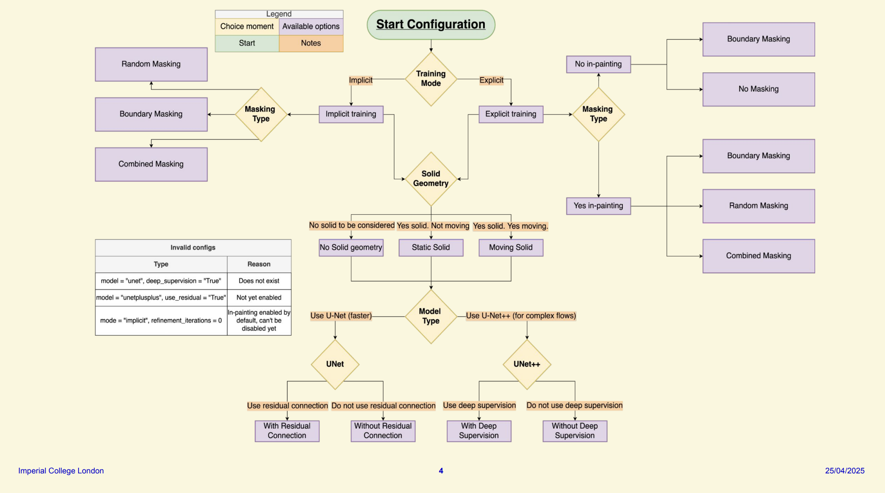
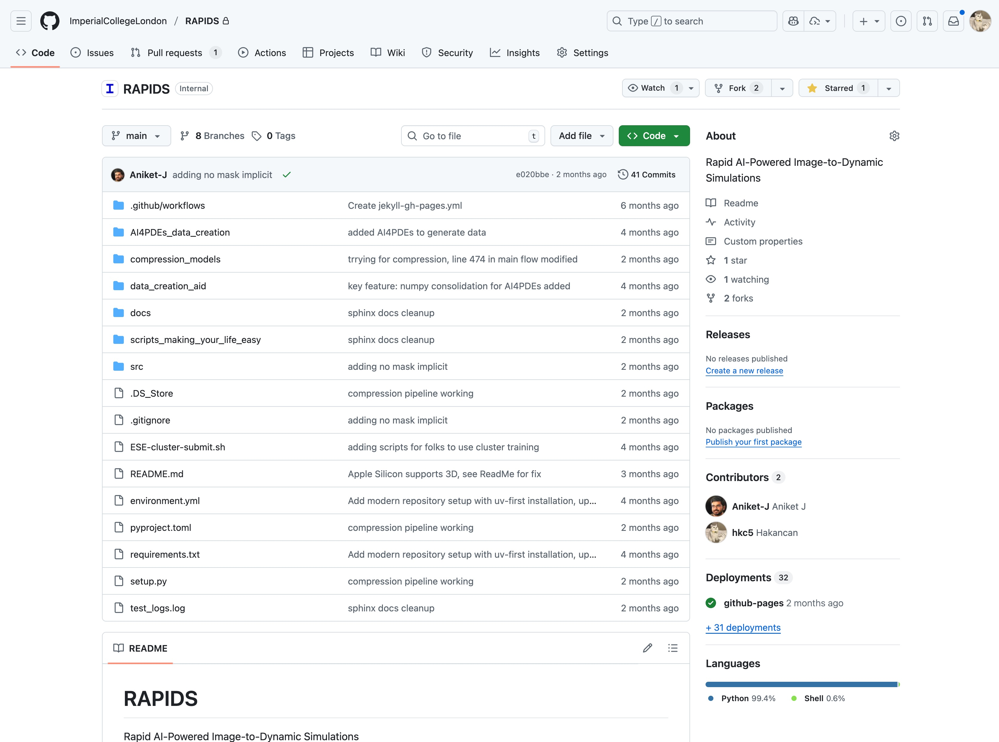

# Optional Criteria 4.2 - Cross-Institutional AI Research

I have contributed to AI/ML research across multiple institutions, working on diverse problems spanning computational physics, medical imaging, and fluid dynamics. My research covers computational fluid dynamics at Max Planck Institute, machine learning for biomedical imaging at Koç University, and grid-invariant AI for turbulent flows at Imperial College London. This breadth demonstrates my ability to apply AI/ML techniques to solve complex problems across different scientific domains.

---

_My research portfolio: 5 publications, 27+ citations across Max Planck, Koç, and Imperial research_

---

### Koç University - Biomedical AI

_Biomedical Optics Express publication - AI/ML for cardiac tissue analysis (Impact Factor: 3.2, h5-index: 58)_

**Saruhan, E. N., Ozturk, H., et al. (2025).** Learning-enhanced 3D fiber orientation mapping in thick cardiac tissues. _Biomedical Optics Express_, 16(8), 3315-3336.

## I contributed AI/ML enhancements to 3D fiber mapping for cardiac tissue analysis in collaboration with Koç University's cardiovascular lab.

### Imperial College London - RAPIDS Project (Ongoing)

_Grid-Invariant AI architecture for turbulent flow simulation - my MSc research_

_Neural network architecture I developed combining autoencoders and adversarial networks_

_RAPIDS open-source repository - manuscript currently in preparation_

This is ongoing research from my Imperial College MSc where I developed a grid-invariant AI architecture for turbulent flow simulation using PyTorch. I ran over 2,000 GPU hours of optimization and achieved 35% improvement in long-term stability and 50% better prediction accuracy. The project is backed by NVIDIA and automotive companies, and we are currently preparing the manuscript for publication.

---

**References:**

- RAPIDS GitHub: https://github.com/ImperialCollegeLondon/RAPIDS
- RAPIDS Presentation: https://docs.google.com/presentation/d/1QNrtneocwtVdyVhZJaoy7EFUgmwjc8Av1lYtuXEiixA/
- Koç University Cardiovascular Lab: https://bio-fluids.org/
- Biomedical Optics Express: https://opg.optica.org/boe/
