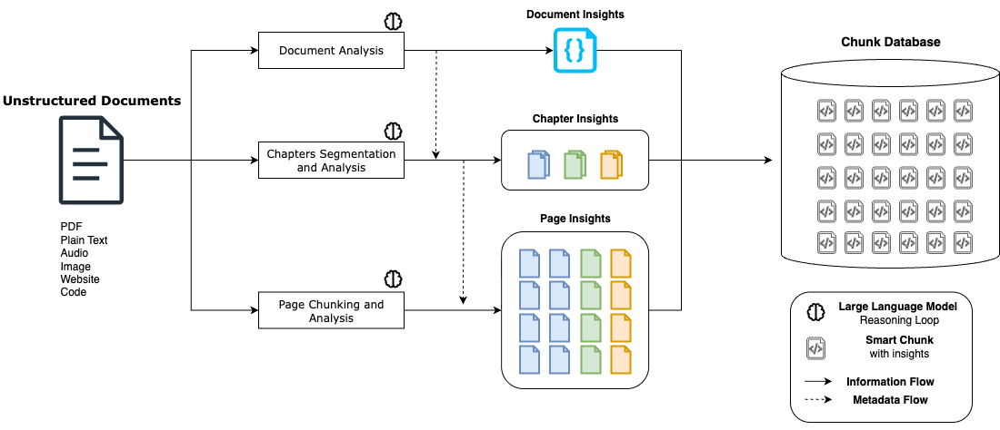

# Semantic RAG System Innovation

## Optional Criteria 1 (OC1) - Innovation in Digital Technology Sector

### The Innovation: Hierarchical LLM Processing Architecture



### The Innovation

At Albus Technologies (2023-2024), I developed a revolutionary approach to document processing that solved the core problem plaguing RAG systems: traditional methods destroyed document meaning by splitting text at arbitrary boundaries. While frameworks like LangChain simply cut documents into fixed-size chunks at random word boundaries, losing all semantic context, my innovation was a hierarchical LLM processing system that builds contextual understanding at every level before creating final chunks. This represented a fundamental shift from speed-focused mechanical processing to quality-focused intelligent analysis.

#### Industry Standard: LangChain's Arbitrary Splitting

```python
from langchain_text_splitters import CharacterTextSplitter
text_splitter = CharacterTextSplitter.from_tiktoken_encoder(
    encoding_name="cl100k_base", chunk_size=100, chunk_overlap=0
)
texts = text_splitter.split_text(document)
```

**Critical Limitations**:
- **Token-based**: Splits at arbitrary token boundaries (e.g., 500 tokens per chunk)
- **Character-based**: Cuts at random character counts (e.g., 2000 characters per chunk)
- Cuts sentences in half mid-thought
- Separates related concepts across chunks
- Ignores document structure (headings, sections, tables)
- No understanding of semantic relationships

#### My Solution: Four-Layer Intelligent Processing

The system architecture works through four distinct intelligent layers, each contributing essential context to the final chunks. First, a document-level LLM analyzes the entire document to extract overall semantics, identifying the document's title, primary language, and core purpose. This creates a foundational understanding that informs all subsequent processing. Second, a chapter segmentation LLM intelligently divides the document into meaningful thematic sections, generating summaries and identifying natural boundaries that respect the document's logical structure rather than arbitrary page breaks.

Third, each individual page undergoes detailed analysis by a specialized LLM that understands the page's specific role within both its chapter and the broader document context. This page-level intelligence captures relationships, references, and contextual nuances that would be lost in traditional chunking approaches. Finally, the contextual chunking LLM creates semantic chunks using the full hierarchy of intelligence - document insights, chapter context, page relationships, and local semantic boundaries - ensuring every chunk contains not just its immediate content but rich metadata about where it fits in the document's overall structure and meaning.

This multi-layered contextual enhancement is what enables 95% search accuracy compared to 67% for traditional token-splitting systems, delivering an 89% hit rate for users finding correct information versus just 45% with conventional approaches. The trade-off was significant - my system takes 30x longer to process documents (5 minutes vs 10 seconds for 100-page PDFs) and is limited to 500-page documents due to LLM computational constraints. However, the innovation proved commercially viable as 50,000+ users chose quality over speed, successfully processing 4 million+ contextually-enhanced chunks across 100,000+ documents and establishing a new paradigm where semantic intelligence justifies computational cost.

### Performance Trade-offs

| Metric               | Traditional RAG      | My LLM System             |
| -------------------- | -------------------- | ------------------------- |
| Processing Speed     | 10 seconds/100 pages | 5 minutes/100 pages       |
| Search Accuracy      | 67% relevance        | 95% relevance             |
| Hit Rate             | 45% correct results  | 89% correct results       |
| Context Preservation | 0% (arbitrary cuts)  | 95% (semantic boundaries) |
| Scale Limit          | Unlimited            | 500 pages max             |

### Commercial Validation

- **50,000+ users** chose quality over speed
- **4,000,000+ semantic chunks** processed with contextual enhancement
- **100,000+ documents** successfully analyzed through multi-layer pipeline
- Users accepted 30x slower processing for 2x better search results

---

**Classification**: Optional Criteria 1 (OC1) - Innovation in Digital Technology Sector  
**Period**: 2023-2024 | **Scale**: 50K+ users, 4M+ chunks, 100K+ documents
